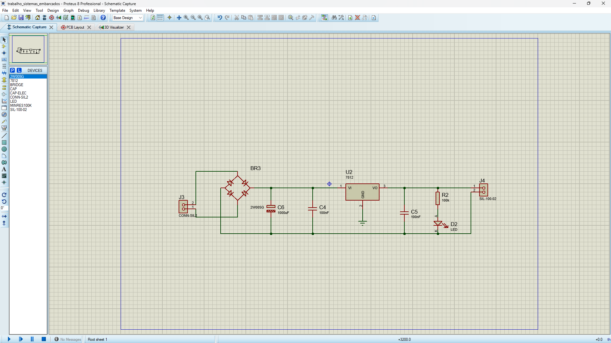
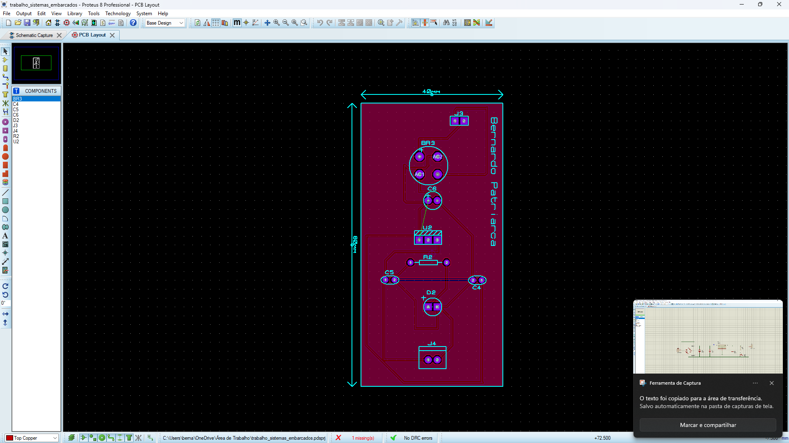
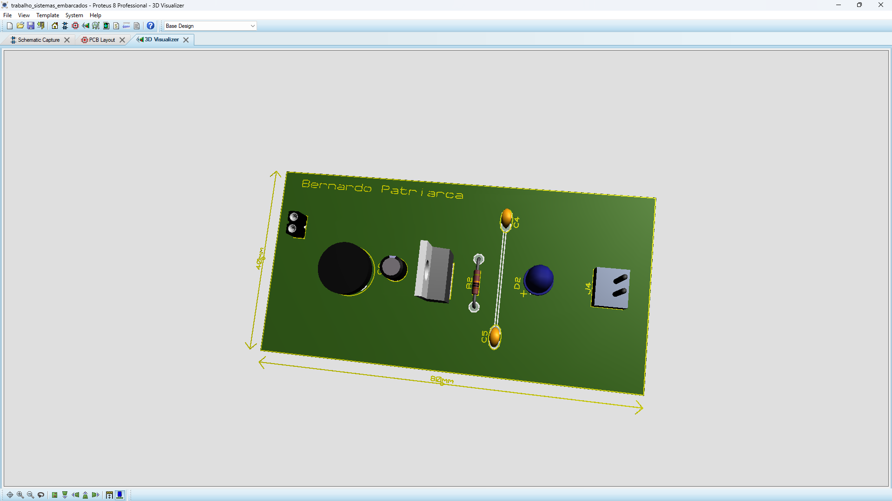
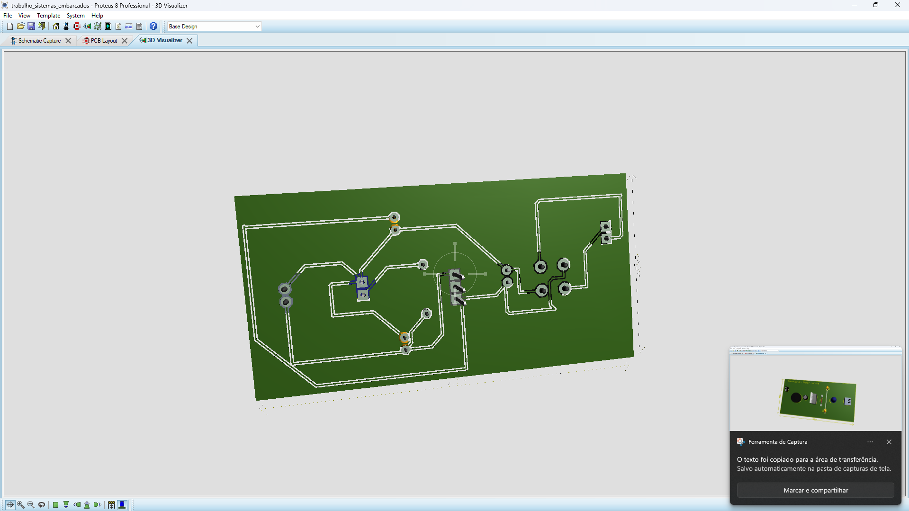

# trabalho_sistemas_embarcados_carregar_celular
Trabalho desenvolvido no Proteus 8, projetando um carregador de celular. O conector macho está ligado ao secundário do transformador (saída). A PCB possui formato retangular de 8 cm x 4 cm (80 x 40 mm). Foram capturadas imagens do esquemático, da PCB e da visualização 3D da placa.

# Carregador de Celular – Projeto no Proteus 8

## Sobre o projeto 

Este projeto apresenta o desenvolvimento de um carregador de celular criado no software Proteus 8 Professional. O objetivo foi simular o processo completo de criação de um sistema eletrônico, passando pelo esquemático, layout da PCB e visualização 3D da placa.

O circuito recebe a tensão vinda do secundário de um transformador, converte corrente alternada (AC) em corrente contínua (DC) por meio de retificação, filtra o sinal e utiliza um regulador de tensão 7812 para garantir uma saída estável e segura.

A placa de circuito impresso (PCB) tem formato retangular com as seguintes dimensões:

80 mm x 40 mm  
8 cm x 4 cm

Um LED indicador foi incluído para mostrar quando o circuito está energizado, facilitando a visualização do funcionamento.

## Como o circuito funciona

O funcionamento do carregador acontece em cinco etapas principais:

**1. Entrada de tensão**  
A alimentação chega ao circuito por meio de um conector ligado ao secundário do transformador.

**2. Retificação**  
A tensão alternada (AC) é convertida em tensão contínua (DC) utilizando uma ponte retificadora.

**3. Filtragem**  
Capacitores ajudam a suavizar as oscilações da tensão retificada, deixando o sinal mais estável.  
Os componentes usados são:  
- C6 – 1000µF (filtro principal)  
- C4 – 100nF  
- C5 – 100nF

**4. Regulação de tensão**  
O regulador 7812 mantém a tensão de saída fixa em 12V, garantindo que o dispositivo conectado receba uma alimentação adequada.

**5. Indicação visual**  
O LED D2, em série com o resistor R2, acende sempre que o circuito está energizado.

## Componentes utilizados

- Ponte retificadora  
- Regulador de tensão 7812  
- Capacitor eletrolítico de 1000µF  
- Capacitores de 100nF  
- LED indicador  
- Resistor de 100kΩ  
- Conectores de entrada e saída

## Imagens do projeto

Abaixo estão as imagens que ilustram as principais etapas do desenvolvimento:

**Esquemático do circuito**  
Essa imagem mostra o diagrama completo do circuito com todas as conexões entre os componentes, incluindo ponte retificadora, capacitores, regulador e LED.

**Layout da PCB – lado superior**  
Aqui é possível ver como os componentes estão posicionados na placa, além das trilhas na camada superior.

**Layout da PCB – lado inferior**  
Nesta imagem aparecem as trilhas da camada inferior, responsáveis por conectar os pontos do circuito.

**Visualização 3D da placa**  
Essa vista em 3D mostra como a placa ficará depois de montada, com todos os componentes no lugar e as dimensões reais de 80 mm x 40 mm.

## Ferramentas utilizadas

- Proteus 8 Professional  
- ISIS (para criação do esquemático)  
- ARES (para desenvolvimento da PCB)  
- Visualizador 3D
